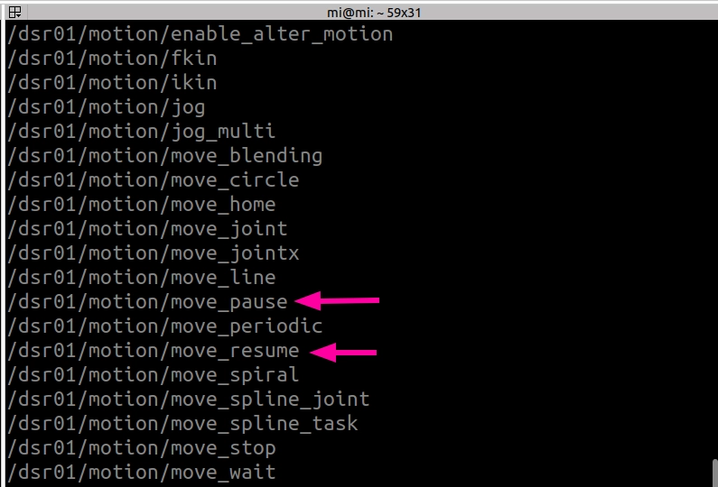
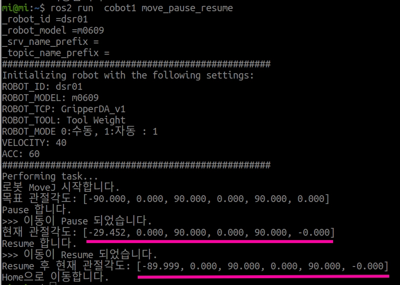
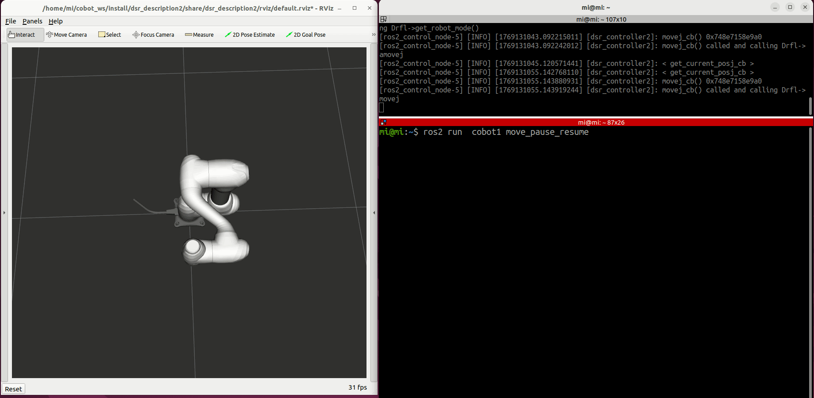
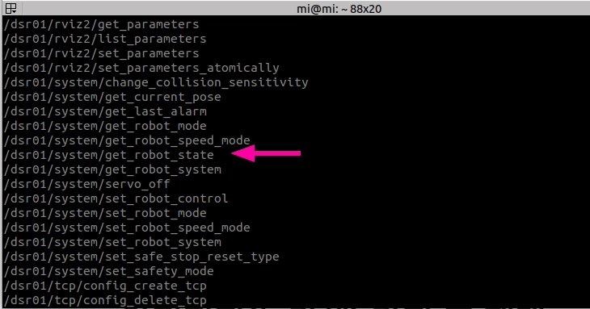
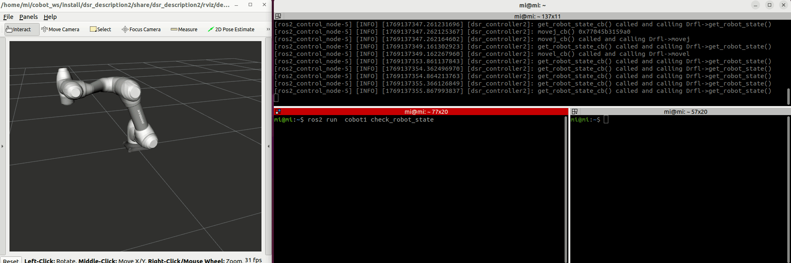
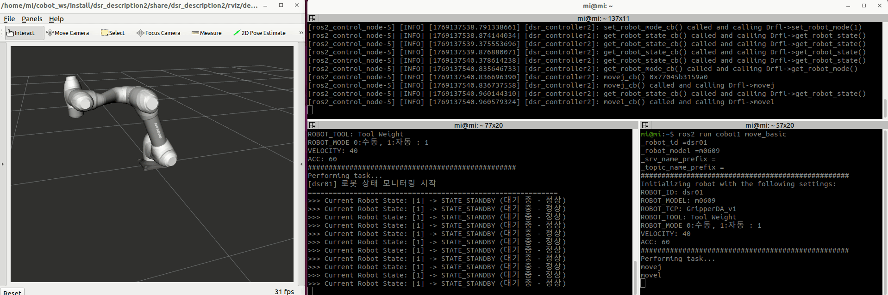
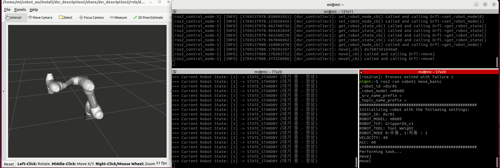
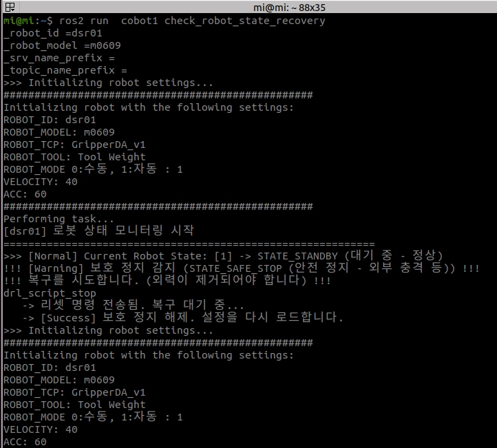

## 일시정지/재개/안전 정지(노란불)해제/비상정지(빨간불)해제

#### 일시 정지 및 재개

1. 기본적으로 제공해주는 서비스나 토픽 테스트 확인

#bringup 후 실행 move_pause와 move_resume 서비스를 제공하고 있다. 
ros2 service list



2. 일시정지 및 재개 서비스를 호출하는 노드 :move_pause_resume.py

```python
import rclpy
import DR_init
import time

# 로봇 설정 상수
ROBOT_ID = "dsr01"
ROBOT_MODEL = "m0609"
ROBOT_TOOL = "Tool Weight"
ROBOT_TCP = "GripperDA_v1"

VELOCITY = 40
ACC = 60

# DR_init 설정
DR_init.__dsr__id = ROBOT_ID
DR_init.__dsr__model = ROBOT_MODEL


def initialize_robot():
    """로봇의 Tool과 TCP를 설정"""
    from DSR_ROBOT2 import set_tool, set_tcp,get_tool,get_tcp,ROBOT_MODE_MANUAL,ROBOT_MODE_AUTONOMOUS  # 필요한 기능만 임포트
    from DSR_ROBOT2 import get_robot_mode,set_robot_mode

    # Tool과 TCP 설정시 매뉴얼 모드로 변경해서 진행
    set_robot_mode(ROBOT_MODE_MANUAL)
    set_tool(ROBOT_TOOL)
    set_tcp(ROBOT_TCP)
    
    set_robot_mode(ROBOT_MODE_AUTONOMOUS)
    time.sleep(2)  # 설정 안정화를 위해 잠시 대기
    # 설정된 상수 출력
    print("#" * 50)
    print("Initializing robot with the following settings:")
    print(f"ROBOT_ID: {ROBOT_ID}")
    print(f"ROBOT_MODEL: {ROBOT_MODEL}")
    print(f"ROBOT_TCP: {get_tcp()}") 
    print(f"ROBOT_TOOL: {get_tool()}")
    print(f"ROBOT_MODE 0:수동, 1:자동 : {get_robot_mode()}")
    print(f"VELOCITY: {VELOCITY}")
    print(f"ACC: {ACC}")
    print("#" * 50)

def call_pause():
    """
    [핵심 기능] 로봇 이동 일시 정지 (Service Call)
    - 라이브러리 함수가 아닌 ROS 2 Service를 직접 호출하여 즉각적인 Pause를 요청합니다.
    """
    from dsr_msgs2.srv import MovePause
    
    # 서비스 클라이언트 생성: /{ROBOT_ID}/motion/move_pause 서비스 호출
    cli = DR_init.__dsr__node.create_client(MovePause, f'/{ROBOT_ID}/motion/move_pause')
    
    # 서비스 서버가 준비될 때까지 대기
    cli.wait_for_service()
    
    # 요청 전송 (비동기 호출) 및 완료 대기
    req = MovePause.Request()
    future = cli.call_async(req)
    rclpy.spin_until_future_complete(DR_init.__dsr__node, future)
    
    print(">>> 이동이 Pause 되었습니다.")

def call_resume():
    """
    [핵심 기능] 로봇 이동 재개 (Service Call)
    - Pause 된 로봇의 남은 모션을 재개합니다.
    """
    from dsr_msgs2.srv import MoveResume
    
    # 서비스 클라이언트 생성: /{ROBOT_ID}/motion/move_resume 서비스 호출
    cli = DR_init.__dsr__node.create_client(MoveResume, f'/{ROBOT_ID}/motion/move_resume')
    cli.wait_for_service()
    
    # 요청 전송 및 완료 대기
    req = MoveResume.Request()
    future = cli.call_async(req)
    rclpy.spin_until_future_complete(DR_init.__dsr__node, future)
    
    print(">>> 이동이 Resume 되었습니다.")


def perform_task():
    """
    [시나리오] 로봇 이동 -> 일시정지 -> 대기 -> 재개 -> 홈 복귀
    """
    print("Performing task...")

    from DSR_ROBOT2 import  posj,amovej,movej,get_current_posj
    import time


    print("로봇 MoveJ 시작합니다.")
    p1 = posj([-90, 0, 90, 0, 90, 0])
    print("목표 관절각도:", p1)
    # movej(p1, vel=20, acc=20) #동기 이동
    amovej(p1, vel=20, acc=20) #비동기 이동
    time.sleep(2)

    print("Pause 합니다.")
    call_pause()
    print("현재 관절각도:",get_current_posj())

    time.sleep(5)
    print("Resume 합니다.")
    call_resume()
    time.sleep(5)
    print("Resume 후 현재 관절각도:",get_current_posj())

    print("Home으로 이동합니다.")
    movej([0, 0, 90, 0, 90, 0], vel=20, acc=20)

def main(args=None):

    rclpy.init(args=args)

    # ★ 노드 생성 후 DR_init에 등록
    node = rclpy.create_node("move_pause_resume", namespace=ROBOT_ID)
    DR_init.__dsr__node = node

    try:
        initialize_robot()
        perform_task()

    except KeyboardInterrupt:
        print("\nNode interrupted by user. Shutting down...")
    except Exception as e:
        print(f"An unexpected error occurred: {e}")
    finally:
        rclpy.shutdown()


if __name__ == "__main__":
    main()
```


3. 코드 실행
    - amovej:비동기로 실행
        
        목표위치로 도달하기 전에 일시정지되어 목표 관절 각도와 현재 관절 각도가 다른 것을 확인

        
        

    -movej:동기로 실행
    

## 로봇 상태 모니터링

로봇 컨트롤러의 현재 작동 모드에 대한 정보를 확인한다.(노란색, 빨간색, 하얀색 )

1. **기본적으로 제공해주는 서비스나 토픽 테스트 확인**

#bringup 후 실행
ros2 service list

    get_robot_state 서비스를 제공하고 있다. 상태코드는 공식 문서 참고

    

2. 두산 로봇 상태 코드 (Robot State) 상세 해석 🔵 🟡 ⚪ 🔴 🟢

    [text](https://doosanrobotics.github.io/doosan-robotics-ros-manual/humble/services/system_services.html#getrobotstate)

    상태 코드 (ID)	상태 상수명 (Constant)	한글 명칭	LED 상태 (Cockpit)	상세 설명 및 의미
0	STATE_INITIALIZING	초기화 중	⚪ 흰색 	로봇 제어기가 부팅되거나 시스템 초기화가 진행 중
1	STATE_STANDBY	대기 중 (정상)	⚪ 흰색	서보가 켜져(On) 있고, 다음 명령을 기다리는 준비 완료(Ready) 상태
2	STATE_MOVING	이동 중		ROS에서는 반영X
3	STATE_SAFE_OFF	서보 꺼짐	🔴 빨간색	제어기 전원은 켜져 있으나, 모터 전원(Servo)이 차단되고 브레이크가 잠긴 상태
4	STATE_TEACHING	티칭 모드		수동 모드에서 직접 교시(Direct Teaching) 버튼을 누르고 있거나 조작 중인 상태
5	STATE_SAFE_STOP	안전 정지	🟡 노란색	충돌 감지, 안전 영역 위반 등으로 인해 일시 정지된 상태 (리셋 필요)
6	STATE_EMERGENCY_STOP	비상 정지	🔴 빨간색	비상 정지 버튼(E-Stop)이 눌려 전원이 차단된 상태. 물리적 해제가 필요
7	STATE_HOMMING	원점 복귀 중		로봇 초기 위치나 엔코더 원점을 찾는 과정을 수행 중
8	STATE_RECOVERY	복구 모드		안전 한계 이탈 등으로 인해 제한된 모드로 복구 운전 중인 상태
9	STATE_SAFE_STOP2	보호 정지 2		SS2(Safe Stop 2) 등 안전 기능에 의한 정지 상태
10	STATE_SAFE_OFF2	서보 꺼짐 2		STO(Safe Torque Off) 등 안전 기능에 의해 동력이 차단된 상태
15	STATE_NOT_READY	준비 안 됨		시스템 에러나 치명적인 오류로 인해 로봇을 사용할 수 없는 상태

3. 상태 확인 :check_robot_state.py

```python
import rclpy
import DR_init
import time
from dsr_msgs2.srv import GetRobotState
# 로봇 설정 (환경에 맞게 수정)
ROBOT_ID = "dsr01"
ROBOT_MODEL = "m0609"
ROBOT_TOOL = "Tool Weight"
ROBOT_TCP = "GripperDA_v1"
# 이동 속도 및 가속도 (필요에 따라 수정)
VELOCITY = 40
ACC = 60


DR_init.__dsr__id = ROBOT_ID
DR_init.__dsr__model = ROBOT_MODEL

# ---------------------------------------------------------
# 로봇 상태 코드 매핑 테이블 (매뉴얼 기준)
# ---------------------------------------------------------
ROBOT_STATE_MAP = {
    0: "STATE_INITIALIZING (초기화 중)",
    1: "STATE_STANDBY (대기 중 - 정상)",
    2: "STATE_MOVING (이동 중)",
    3: "STATE_SAFE_OFF (서보 꺼짐)",
    4: "STATE_TEACHING (티칭 모드)",
    5: "STATE_SAFE_STOP (안전 정지 - 외부 충격 등)",
    6: "STATE_EMERGENCY_STOP (비상 정지)",
    7: "STATE_HOMMING (호밍 중)",
    8: "STATE_RECOVERY (복구 모드)",
    9: "STATE_SAFE_STOP2 (안전 정지 2)",
    10: "STATE_SAFE_OFF2 (서보 꺼짐 2)",
    11: "STATE_RESERVED1",
    12: "STATE_RESERVED2",
    13: "STATE_RESERVED3",
    14: "STATE_RESERVED4",
    15: "STATE_NOT_READY (준비 안 됨)"
}
def initialize_robot():
    """로봇의 Tool과 TCP를 설정"""
    from DSR_ROBOT2 import set_tool, set_tcp,get_tool,get_tcp,ROBOT_MODE_MANUAL,ROBOT_MODE_AUTONOMOUS  # 필요한 기능만 임포트
    from DSR_ROBOT2 import get_robot_mode,set_robot_mode

    # Tool과 TCP 설정시 매뉴얼 모드로 변경해서 진행
    set_robot_mode(ROBOT_MODE_MANUAL)
    set_tool(ROBOT_TOOL)
    set_tcp(ROBOT_TCP)
    
    set_robot_mode(ROBOT_MODE_AUTONOMOUS)
    time.sleep(2)  # 설정 안정화를 위해 잠시 대기
    # 설정된 상수 출력
    print("#" * 50)
    print("Initializing robot with the following settings:")
    print(f"ROBOT_ID: {ROBOT_ID}")
    print(f"ROBOT_MODEL: {ROBOT_MODEL}")
    print(f"ROBOT_TCP: {get_tcp()}") 
    print(f"ROBOT_TOOL: {get_tool()}")
    print(f"ROBOT_MODE 0:수동, 1:자동 : {get_robot_mode()}")
    print(f"VELOCITY: {VELOCITY}")
    print(f"ACC: {ACC}")
    print("#" * 50)


def perform_task():
    """로봇이 수행할 작업"""
    print("Performing task...")
    # 상태 조회 함수 임포트
    from DSR_ROBOT2 import get_robot_state

    print(f"[{ROBOT_ID}] 로봇 상태 모니터링 시작")
    print("=" * 60)


    while True:
        # 1. 상태값(숫자) 조회
        state_code = get_robot_state()
        
        # 2. 딕셔너리에서 상태 의미(문자열) 찾기
        # .get(key, default) : 매핑되지 않은 번호가 오면 default 값 반환
        state_desc = ROBOT_STATE_MAP.get(state_code, "UNKNOWN_STATE (알 수 없음)")
        
        # 3. 결과 출력
        # 상태에 따라 강조 표시 (옵션)
        prefix = ">>>"
        if state_code in [5, 6, 9]: # 정지/비상 상황
            prefix = "!!!"
        elif state_code in [3, 10]: # 서보 꺼짐
            prefix = "***"

        print(f"{prefix} Current Robot State: [{state_code}] -> {state_desc}")

        # 0.5초 간격으로 반복
        time.sleep(0.5) 


def main(args=None):
    rclpy.init(args=args)
    node = rclpy.create_node("check_robot_state", namespace=ROBOT_ID)
    DR_init.__dsr__node = node

    try:
        # 초기화는 한 번만 수행
        initialize_robot()

        # 작업 수행 (한 번만 호출)
        perform_task()

    except KeyboardInterrupt:
        print("\nNode interrupted by user. Shutting down...")
    except Exception as e:
        print(f"An unexpected error occurred: {e}")
    finally:
        rclpy.shutdown()

if __name__ == "__main__":
    main()
```

4.  **동작 중:**
    - bringup launch
    - 로봇 상태 체크: 1 `STATE_STANDBY`
    - move basic 실행
    - 로봇 상태 체크: 1 `STATE_STANDBY`




5. **안전 정지: 로봇을 밀어서 충돌감지 일으킴**
    - move basic 실행
    - 로봇 상태 체크: 1 `STATE_STANDBY`
    - 로봇을 밀어서 충돌 일으킴 (노란색 LED 점등)
    - 로봇 상태 체크: 5  `STATE_SAFE_STOP` 안전 정지

DART-platform에 robot limit 설정에 따라 빨간색이 점등 될 수 있음.


6. **비상 정지: 티치 펜던트의 비상 정지 버튼을 누름.**
    - move basic 실행
    - 로봇 상태 체크: 1 `STATE_STANDBY`
    - 티치 펜던트의 비상 정지 버튼을 누름
    - 로봇 상태 체크: 6 `STATE_EMERGENCY_STOP` 비상 정지
    - 티치 펜던트의 비상 정지 버튼을 돌려서 해제
    - 로봇 상태 체크: 3 `STATE_SAFE_OFF` 서보 꺼짐
  


## 안전정지(노란색) 감지 후 재개

1. **안전 정지(Safe Stop) 복구 흐름:**
    - 코드로 **"리셋(Reset)" 명령 한 번**만 보내면 된다.
    - 서보가 꺼지지 않았기 때문에 즉시 정상 상태(`1: STANDBY`)로 돌아 온다.
    - **절차:**
        1. 스크립트 정지 (`drl_script_stop`)
        2. 리셋 명령 전송 (`call_set_robot_control(2)`)
        3. **즉시 복구 완료** (`State 5` -> `State 1`)
- **2.  코드:check_robot_state_recovery.py**

```python
import rclpy
import DR_init
import time
from dsr_msgs2.srv import SetRobotControl # ★ 핵심: 제어 상태 강제 변환 서비스

# 로봇 설정 (환경에 맞게 수정)
ROBOT_ID = "dsr01"
ROBOT_MODEL = "m0609"
ROBOT_TOOL = "Tool Weight"
ROBOT_TCP = "GripperDA_v1"

# 이동 속도 및 가속도 (필요에 따라 수정)
VELOCITY = 40
ACC = 60

DR_init.__dsr__id = ROBOT_ID
DR_init.__dsr__model = ROBOT_MODEL

# [추가] 제어 명령 상수
CONTROL_RESET_SAFE_STOP = 2  # 보호 정지 해제
CONTROL_RESET_SAFE_OFF = 3   # 서보 켜기 (Safe Off -> Standby)

# ---------------------------------------------------------
# 로봇 상태 코드 매핑 테이블 (매뉴얼 기준)
# ---------------------------------------------------------
ROBOT_STATE_MAP = {
    0: "STATE_INITIALIZING (초기화 중)",
    1: "STATE_STANDBY (대기 중 - 정상)",
    2: "STATE_MOVING (이동 중)",
    3: "STATE_SAFE_OFF (서보 꺼짐)",
    4: "STATE_TEACHING (티칭 모드)",
    5: "STATE_SAFE_STOP (안전 정지 - 외부 충격 등)",
    6: "STATE_EMERGENCY_STOP (비상 정지)",
    7: "STATE_HOMMING (호밍 중)",
    8: "STATE_RECOVERY (복구 모드)",
    9: "STATE_SAFE_STOP2 (안전 정지 2)",
    10: "STATE_SAFE_OFF2 (서보 꺼짐 2)",
    11: "STATE_RESERVED1",
    12: "STATE_RESERVED2",
    13: "STATE_RESERVED3",
    14: "STATE_RESERVED4",
    15: "STATE_NOT_READY (준비 안 됨)"
}

def call_set_robot_control(control_value):
    """로봇 제어 상태를 강제로 리셋하거나 변경하는 함수"""
    node = DR_init.__dsr__node
    srv_name = f'/{ROBOT_ID}/system/set_robot_control'
    cli = node.create_client(SetRobotControl, srv_name)
    
    if not cli.wait_for_service(timeout_sec=1.0):
        print(f"[Err] {srv_name} 서비스를 찾을 수 없습니다.")
        return False

    req = SetRobotControl.Request()
    req.robot_control = control_value
    
    future = cli.call_async(req)
    
    # 결과 대기 (블로킹 없이 처리하기 위해 spin_once 사용)
    start_wait = time.time()
    while not future.done():
        rclpy.spin_once(node, timeout_sec=0.01)
        
        # [수정] 타임아웃을 3.0초 -> 5.0초로 증가 (컨트롤러 처리 지연 대비)
        if time.time() - start_wait > 5.0: 
            print("[Err] 서비스 호출 시간 초과 (컨트롤러 응답 지연)")
            return False

    try:
        res = future.result()
        return res.success
    except Exception as e:
        print(f"[Err] 서비스 호출 실패: {e}")
        return False

def initialize_robot():
    """로봇의 Tool과 TCP를 설정"""
    from DSR_ROBOT2 import set_tool, set_tcp, get_tool, get_tcp, ROBOT_MODE_MANUAL, ROBOT_MODE_AUTONOMOUS
    from DSR_ROBOT2 import get_robot_mode, set_robot_mode, set_safe_stop_reset_type

    print(">>> Initializing robot settings...")

    # # [추가] 안전 정지 리셋 타입 설정 (0: Program Stop)
    # set_safe_stop_reset_type(0)

    # Tool과 TCP 설정시 매뉴얼 모드로 변경해서 진행 (안전성 확보)
    set_robot_mode(ROBOT_MODE_MANUAL)
    set_tool(ROBOT_TOOL)
    set_tcp(ROBOT_TCP)
    
    set_robot_mode(ROBOT_MODE_AUTONOMOUS)
    time.sleep(2)  # 설정 안정화를 위해 잠시 대기
    
    # 설정된 상수 출력
    print("#" * 50)
    print("Initializing robot with the following settings:")
    print(f"ROBOT_ID: {ROBOT_ID}")
    print(f"ROBOT_MODEL: {ROBOT_MODEL}")
    print(f"ROBOT_TCP: {get_tcp()}") 
    print(f"ROBOT_TOOL: {get_tool()}")
    print(f"ROBOT_MODE 0:수동, 1:자동 : {get_robot_mode()}")
    print(f"VELOCITY: {VELOCITY}")
    print(f"ACC: {ACC}")
    print("#" * 50)

def perform_task():
    """로봇이 수행할 작업 (상태 모니터링 및 복구)"""
    print("Performing task...")
    # 상태 조회 및 제어 함수 임포트
    from DSR_ROBOT2 import get_robot_state, drl_script_stop, DR_QSTOP_STO,get_last_alarm

    print(f"[{ROBOT_ID}] 로봇 상태 모니터링 시작")
    print("=" * 60)

    while True:
        # 1. 상태값(숫자) 조회
        state_code = get_robot_state()
        
        # 2. 딕셔너리에서 상태 의미(문자열) 찾기
        state_desc = ROBOT_STATE_MAP.get(state_code, "UNKNOWN_STATE")
        
        # 3. 상태에 따른 분기 처리
        if state_code == 1:
            # 정상 상태
            print(f">>> [Normal] Current Robot State: [{state_code}] -> {state_desc}", end='\r')
        
        elif state_code == 5:
            # [복구 로직] STATE_SAFE_STOP (안전 정지)
            print(f"\n!!! [Warning] 보호 정지 감지 ({state_desc}) !!!")
            print("!!! 복구를 시도합니다. (외력이 제거되어야 합니다) !!!")
            
            # 1. 스크립트 정지 (안전 확보)
            drl_script_stop(DR_QSTOP_STO)

            time.sleep(3)  # 외력 제거 대기
            
            # 2. ★ SetRobotControl(2)로 강제 리셋 시도
            if call_set_robot_control(CONTROL_RESET_SAFE_STOP): # 리셋 명령 전송
                print("   -> 리셋 명령 전송됨. 복구 대기 중...")
                time.sleep(2.0)
                if get_robot_state() == 1:
                    print("   -> [Success] 보호 정지 해제. 설정을 다시 로드합니다.")
                    initialize_robot() # 초기화 재수행
            else:
                print("   -> 리셋 실패.")
                time.sleep(1.0)

            # -------------------------------------------------------------
            # [CASE 2] STATE_SAFE_OFF (3) - 서보 꺼짐 (복구 시퀀스 적용)
            # -------------------------------------------------------------
        elif state_code == 3:
            # [복구 로직] STATE_SAFE_OFF (서보 꺼짐)
            print(f"\n*** [Error] 서보 꺼짐 감지 ({state_desc}) ***")
            print("*** 서보 ON (Reset Safe Off)을 시도합니다. ***")
            
            # 1. 기존 스크립트 정지 (필수)
            drl_script_stop(DR_QSTOP_STO)
            time.sleep(0.5)
            
            # 2. ★ SetRobotControl(3)으로 서보 ON 시도
            if call_set_robot_control(CONTROL_RESET_SAFE_OFF):
                print("   -> 서보 ON 명령 전송됨. 기동 대기 중...")
                time.sleep(3.0)
                if get_robot_state() == 1:
                    print("   -> [Success] 서보 ON 완료.")
                    initialize_robot() # 초기화 재수행
            else:
                # 여전히 3번 상태라면 하드웨어 스위치 문제
                alarm = get_last_alarm()
                print(f">>> [Fail] 서보 ON 실패. 현재 상태: {current_state}")
                if alarm:
                    print(f"   - 거절 사유(알람): {alarm}")
                print("   !!! 조치 필요: [비상정지 버튼] 해제 또는 [티칭 펜던트 스위치(Auto)] 확인 필요 !!!\n")
                time.sleep(2) 
                
        else:
            # 그 외 상태
            print(f">>> [Check] Current Robot State: [{state_code}] -> {state_desc}")

        # 0.5초 간격으로 반복
        time.sleep(0.5) 

def main(args=None):
    rclpy.init(args=args)
    node = rclpy.create_node("check_robot_state", namespace=ROBOT_ID)
    DR_init.__dsr__node = node

    try:
        # 초기화는 한 번만 수행
        initialize_robot()

        # 작업 수행 (한 번만 호출)
        perform_task()

    except KeyboardInterrupt:
        print("\nNode interrupted by user. Shutting down...")
    except Exception as e:
        print(f"An unexpected error occurred: {e}")
    finally:
        rclpy.shutdown()

if __name__ == "__main__":
    main()
```




## 비상정지(빨간색) 감지 후 재개

1. **비상 정지 (Emergency Stop) 복구 흐름:**
    - 비상 정지는 **소프트웨어만으로는 절대 복구할 수 없다.**
    - 반드시 **사람의 개입(버튼 해제)이** 선행되어야 하며, 그 후 코드로 서보를 다시 켜는 과정을 거쳐야한다.
    - **절차:**
        1. **[사람]** 비상 정지 버튼을 돌려서 해제 (물리적 조치)
        2. 로봇 상태가 `6 (E-Stop)` ->  `3 (Safe Off)` 으로 바뀜을 감지
        3. 스크립트 정지 (`drl_script_stop`)
        4. **서보 ON 명령 전송** (`call_set_robot_control(3)`)
        5. **대기 시간 필요** (브레이크 해제음 '철컥' 소리와 함께 약 3초 소요)
        6. **복구 완료** (`State 3` -> `State 1`)
  2.  코드:check_robot_state_recovery.py
    ```python
    import rclpy
import DR_init
import time
from dsr_msgs2.srv import SetRobotControl # ★ 핵심: 제어 상태 강제 변환 서비스

# 로봇 설정 (환경에 맞게 수정)
ROBOT_ID = "dsr01"
ROBOT_MODEL = "m0609"
ROBOT_TOOL = "Tool Weight"
ROBOT_TCP = "GripperDA_v1"

# 이동 속도 및 가속도 (필요에 따라 수정)
VELOCITY = 40
ACC = 60

DR_init.__dsr__id = ROBOT_ID
DR_init.__dsr__model = ROBOT_MODEL

# [추가] 제어 명령 상수
CONTROL_RESET_SAFE_STOP = 2  # 보호 정지 해제
CONTROL_RESET_SAFE_OFF = 3   # 서보 켜기 (Safe Off -> Standby)

# ---------------------------------------------------------
# 로봇 상태 코드 매핑 테이블 (매뉴얼 기준)
# ---------------------------------------------------------
ROBOT_STATE_MAP = {
    0: "STATE_INITIALIZING (초기화 중)",
    1: "STATE_STANDBY (대기 중 - 정상)",
    2: "STATE_MOVING (이동 중)",
    3: "STATE_SAFE_OFF (서보 꺼짐)",
    4: "STATE_TEACHING (티칭 모드)",
    5: "STATE_SAFE_STOP (안전 정지 - 외부 충격 등)",
    6: "STATE_EMERGENCY_STOP (비상 정지)",
    7: "STATE_HOMMING (호밍 중)",
    8: "STATE_RECOVERY (복구 모드)",
    9: "STATE_SAFE_STOP2 (안전 정지 2)",
    10: "STATE_SAFE_OFF2 (서보 꺼짐 2)",
    11: "STATE_RESERVED1",
    12: "STATE_RESERVED2",
    13: "STATE_RESERVED3",
    14: "STATE_RESERVED4",
    15: "STATE_NOT_READY (준비 안 됨)"
}

def call_set_robot_control(control_value):
    """로봇 제어 상태를 강제로 리셋하거나 변경하는 함수"""
    node = DR_init.__dsr__node
    srv_name = f'/{ROBOT_ID}/system/set_robot_control'
    cli = node.create_client(SetRobotControl, srv_name)
    
    if not cli.wait_for_service(timeout_sec=1.0):
        print(f"[Err] {srv_name} 서비스를 찾을 수 없습니다.")
        return False

    req = SetRobotControl.Request()
    req.robot_control = control_value
    
    future = cli.call_async(req)
    
    # 결과 대기 (블로킹 없이 처리하기 위해 spin_once 사용)
    start_wait = time.time()
    while not future.done():
        rclpy.spin_once(node, timeout_sec=0.01)
        
        # [수정] 타임아웃을 3.0초 -> 5.0초로 증가 (컨트롤러 처리 지연 대비)
        if time.time() - start_wait > 5.0: 
            print("[Err] 서비스 호출 시간 초과 (컨트롤러 응답 지연)")
            return False

    try:
        res = future.result()
        return res.success
    except Exception as e:
        print(f"[Err] 서비스 호출 실패: {e}")
        return False

def initialize_robot():
    """로봇의 Tool과 TCP를 설정"""
    from DSR_ROBOT2 import set_tool, set_tcp, get_tool, get_tcp, ROBOT_MODE_MANUAL, ROBOT_MODE_AUTONOMOUS
    from DSR_ROBOT2 import get_robot_mode, set_robot_mode, set_safe_stop_reset_type

    print(">>> Initializing robot settings...")

    # # [추가] 안전 정지 리셋 타입 설정 (0: Program Stop)
    # set_safe_stop_reset_type(0)

    # Tool과 TCP 설정시 매뉴얼 모드로 변경해서 진행 (안전성 확보)
    set_robot_mode(ROBOT_MODE_MANUAL)
    set_tool(ROBOT_TOOL)
    set_tcp(ROBOT_TCP)
    
    set_robot_mode(ROBOT_MODE_AUTONOMOUS)
    time.sleep(2)  # 설정 안정화를 위해 잠시 대기
    
    # 설정된 상수 출력
    print("#" * 50)
    print("Initializing robot with the following settings:")
    print(f"ROBOT_ID: {ROBOT_ID}")
    print(f"ROBOT_MODEL: {ROBOT_MODEL}")
    print(f"ROBOT_TCP: {get_tcp()}") 
    print(f"ROBOT_TOOL: {get_tool()}")
    print(f"ROBOT_MODE 0:수동, 1:자동 : {get_robot_mode()}")
    print(f"VELOCITY: {VELOCITY}")
    print(f"ACC: {ACC}")
    print("#" * 50)

def perform_task():
    """로봇이 수행할 작업 (상태 모니터링 및 복구)"""
    print("Performing task...")
    # 상태 조회 및 제어 함수 임포트
    from DSR_ROBOT2 import get_robot_state, drl_script_stop, DR_QSTOP_STO,get_last_alarm

    print(f"[{ROBOT_ID}] 로봇 상태 모니터링 시작")
    print("=" * 60)

    while True:
        # 1. 상태값(숫자) 조회
        state_code = get_robot_state()
        
        # 2. 딕셔너리에서 상태 의미(문자열) 찾기
        state_desc = ROBOT_STATE_MAP.get(state_code, "UNKNOWN_STATE")
        
        # 3. 상태에 따른 분기 처리
        if state_code == 1:
            # 정상 상태
            print(f">>> [Normal] Current Robot State: [{state_code}] -> {state_desc}", end='\r')
        
        elif state_code == 5:
            # [복구 로직] STATE_SAFE_STOP (안전 정지)
            print(f"\n!!! [Warning] 보호 정지 감지 ({state_desc}) !!!")
            print("!!! 복구를 시도합니다. (외력이 제거되어야 합니다) !!!")
            
            # 1. 스크립트 정지 (안전 확보)
            drl_script_stop(DR_QSTOP_STO)

            time.sleep(3)  # 외력 제거 대기
            
            # 2. ★ SetRobotControl(2)로 강제 리셋 시도
            if call_set_robot_control(CONTROL_RESET_SAFE_STOP): # 리셋 명령 전송
                print("   -> 리셋 명령 전송됨. 복구 대기 중...")
                time.sleep(2.0)
                if get_robot_state() == 1:
                    print("   -> [Success] 보호 정지 해제. 설정을 다시 로드합니다.")
                    initialize_robot() # 초기화 재수행
            else:
                print("   -> 리셋 실패.")
                time.sleep(1.0)

            # -------------------------------------------------------------
            # [CASE 2] STATE_SAFE_OFF (3) - 서보 꺼짐 (복구 시퀀스 적용)
            # -------------------------------------------------------------
        elif state_code == 3:
            # [복구 로직] STATE_SAFE_OFF (서보 꺼짐)
            print(f"\n*** [Error] 서보 꺼짐 감지 ({state_desc}) ***")
            print("*** 서보 ON (Reset Safe Off)을 시도합니다. ***")
            
            # 1. 기존 스크립트 정지 (필수)
            drl_script_stop(DR_QSTOP_STO)
            time.sleep(0.5)
            
            # 2. ★ SetRobotControl(3)으로 서보 ON 시도
            if call_set_robot_control(CONTROL_RESET_SAFE_OFF):
                print("   -> 서보 ON 명령 전송됨. 기동 대기 중...")
                time.sleep(3.0)
                if get_robot_state() == 1:
                    print("   -> [Success] 서보 ON 완료.")
                    initialize_robot() # 초기화 재수행
            else:
                # 여전히 3번 상태라면 하드웨어 스위치 문제
                alarm = get_last_alarm()
                print(f">>> [Fail] 서보 ON 실패. 현재 상태: {current_state}")
                if alarm:
                    print(f"   - 거절 사유(알람): {alarm}")
                print("   !!! 조치 필요: [비상정지 버튼] 해제 또는 [티칭 펜던트 스위치(Auto)] 확인 필요 !!!\n")
                time.sleep(2) 
                
        else:
            # 그 외 상태
            print(f">>> [Check] Current Robot State: [{state_code}] -> {state_desc}")

        # 0.5초 간격으로 반복
        time.sleep(0.5) 

def main(args=None):
    rclpy.init(args=args)
    node = rclpy.create_node("check_robot_state", namespace=ROBOT_ID)
    DR_init.__dsr__node = node

    try:
        # 초기화는 한 번만 수행
        initialize_robot()

        # 작업 수행 (한 번만 호출)
        perform_task()

    except KeyboardInterrupt:
        print("\nNode interrupted by user. Shutting down...")
    except Exception as e:
        print(f"An unexpected error occurred: {e}")
    finally:
        rclpy.shutdown()

if __name__ == "__main__":
    main()
```